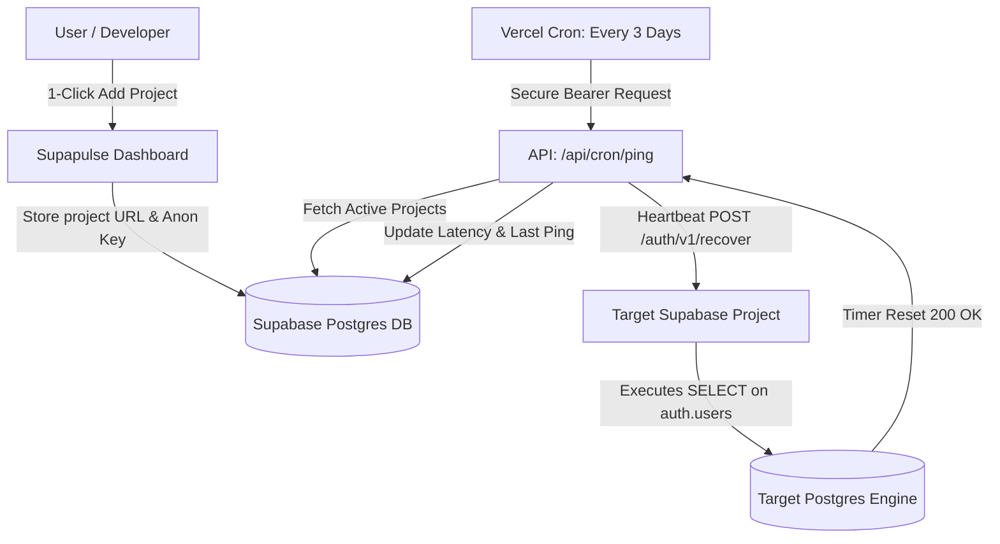

<div align="center">
  
  
  # Supapulse ⚡
  
  **Keep your free-tier Supabase projects awake, active, and unpaused — forever.**
  
  [](https://opensource.org/licenses/MIT)
  [](https://nextjs.org/)
  [](https://supabase.com)
  [](https://vercel.com)
  [](CONTRIBUTING.md)

  [Live Demo](https://supapulse.huryasar.com) · [Report Bug](https://github.com/atalayhuryasar/Supapulse/issues) · [Request Feature](https://github.com/atalayhuryasar/Supapulse/issues) · [Türkçe Doküman](README.tr.md)

  <br/>

  [](https://vercel.com/new/clone?repository-url=https%3A%2F%2Fgithub.com%2Fatalayhuryasar%2FSupapulse&env=NEXT_PUBLIC_SUPABASE_URL,NEXT_PUBLIC_SUPABASE_ANON_KEY,SUPABASE_SERVICE_ROLE_KEY,CRON_SECRET,NEXT_PUBLIC_SITE_URL&project-name=supapulse&repo-name=supapulse)

</div>

<br/>

## 💡 The Problem

Supabase automatically pauses free-tier projects after **7 days of database inactivity** to conserve infrastructure resources. When a project is paused:
- API requests fail with 503 errors.
- Cold restarts take 30–60 seconds.
- Side projects, staging environments, and client demos get unexpectedly interrupted.

Setting up custom GitHub Actions workflows or external cron jobs for every project is repetitive and cumbersome.

## ⚡ The Solution: Supapulse

**Supapulse** is a lightweight, zero-maintenance, open-source heartbeat engine designed to prevent automatic pausing by executing automated, genuine PostgreSQL queries against your projects every 3 days.

- 🔄 **Real Database Activity:** Executes lightweight SQL queries against the GoTrue auth engine (`auth.users`) to guarantee the Postgres pooler resets its inactivity timer.
- 🔒 **Zero Privileged Keys:** Only your **Anon Public Key** is ever needed. Your master `service_role` secret key is **never** requested.
- 🚀 **One-Click Deploy:** 100% serverless, zero cost on Vercel + Supabase Free Tier.
- 📊 **Instant Dashboard:** One-click "Ping Now" button, latency tracking, and status logs.

---

## 🛠️ Architecture



---

## 🚀 Quickstart & Self-Hosting

Deploy your own instance of Supapulse in less than 2 minutes:

### 1. One-Click Deploy to Vercel

Click the button below to deploy your private Supapulse instance:

[](https://vercel.com/new/clone?repository-url=https%3A%2F%2Fgithub.com%2Fatalayhuryasar%2FSupapulse&env=NEXT_PUBLIC_SUPABASE_URL,NEXT_PUBLIC_SUPABASE_ANON_KEY,SUPABASE_SERVICE_ROLE_KEY,CRON_SECRET,NEXT_PUBLIC_SITE_URL&project-name=supapulse&repo-name=supapulse)

### 2. Manual Setup (Local Development)

```bash
# Clone repository
git clone https://github.com/atalayhuryasar/Supapulse.git
cd Supapulse

# Install dependencies
npm install

# Copy environment template
cp .env.example .env.local
```

### 3. Database Migration

1. Create a project at [supabase.com](https://supabase.com).
2. Go to **SQL Editor** in the Supabase Dashboard.
3. Paste and run the contents of [`supabase_schema.sql`](supabase_schema.sql).

### 4. Configure Environment Variables

Fill in `.env.local`:

```env
NEXT_PUBLIC_SUPABASE_URL=https://your-supabase-id.supabase.co
NEXT_PUBLIC_SUPABASE_ANON_KEY=your-supabase-anon-key
SUPABASE_SERVICE_ROLE_KEY=your-supabase-service-role-key

CRON_SECRET=your-random-cron-secret-key
NEXT_PUBLIC_SITE_URL=http://localhost:3000
```

### 5. Run Locally

```bash
npm run dev
```

Open [http://localhost:3000](http://localhost:3000) in your browser.

---

## 🔒 Security & Privacy

1. **No Sensitive Keys:** Supapulse never requests or stores Supabase `service_role` secrets. Only public `anon` / `publishable` keys are used.
2. **Row Level Security (RLS):** Every user can only view, edit, or delete their own registered projects.
3. **Protected Cron Worker:** The `/api/cron/ping` endpoint rejects any request without a valid `Authorization: Bearer <CRON_SECRET>` header.

---

## 🤝 Contributing

Contributions, bug reports, and feature requests are welcome!
Please check out our [CONTRIBUTING.md](CONTRIBUTING.md) guide before submitting a PR.

---

## 📄 License

This project is licensed under the [MIT License](LICENSE) — free for personal and commercial use.
