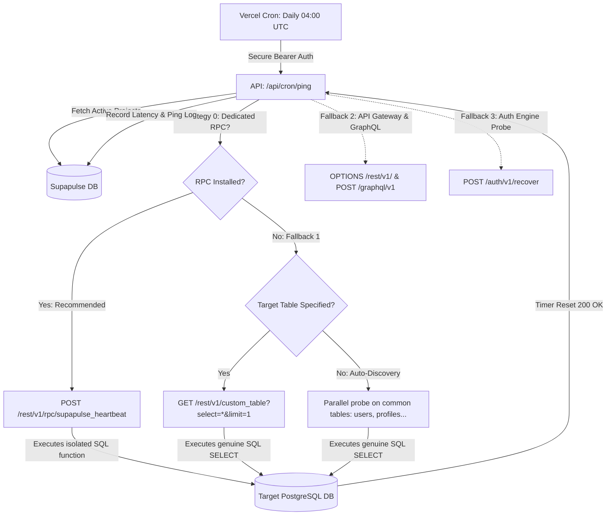

<div align="center">
  
  
  # Supapulse ⚡
  
  **Keep your free-tier Supabase projects awake, active, and unpaused — forever.**
  
  [](https://opensource.org/licenses/MIT)
  [](https://nextjs.org/)
  [](https://supabase.com)
  [](https://vercel.com)
  [](CONTRIBUTING.md)

  [Live Demo](https://supapulse.huryasar.com) · [Report Bug](https://github.com/atalayhuryasar/Supapulse/issues) · [Request Feature](https://github.com/atalayhuryasar/Supapulse/issues) · [Türkçe Doküman](README.tr.md)

  <br/>

  [](https://vercel.com/new/clone?repository-url=https%3A%2F%2Fgithub.com%2Fatalayhuryasar%2FSupapulse&env=NEXT_PUBLIC_SUPABASE_URL,NEXT_PUBLIC_SUPABASE_ANON_KEY,SUPABASE_SERVICE_ROLE_KEY,CRON_SECRET,NEXT_PUBLIC_SITE_URL&project-name=supapulse&repo-name=supapulse)

</div>

<br/>

## 💡 The Problem

Supabase automatically pauses free-tier projects after **7 days of database inactivity** to conserve infrastructure resources. When a project is paused:
- API requests fail with 503 errors.
- Cold restarts take 30–60 seconds.
- Side projects, staging environments, and client demos get unexpectedly interrupted.

Setting up custom GitHub Actions workflows or external cron jobs for every project is repetitive and cumbersome.

## ⚡ The Solution: Supapulse

**Supapulse** is a lightweight, zero-maintenance, open-source heartbeat engine designed to prevent automatic pausing by executing automated, genuine PostgreSQL queries and API traffic against your projects **daily**.

- 🔄 **Multi-Layered Database Activity:** Executes genuine PostgREST read queries and gateway heartbeats to guarantee the Postgres pooler and Supabase API gateway reset their inactivity timer.
- 🎯 **Optional Custom Target Table:** Specify an exact table (e.g., `todos`, `profiles`, `products`) or let Supapulse automatically probe common schema tables.
- 🔒 **Zero Privileged Keys:** Only your **Anon Public Key** is ever needed. Your master `service_role` secret key is **never** requested.
- 🚀 **One-Click Deploy:** 100% serverless, zero cost on Vercel + Supabase Free Tier.
- 📊 **Instant Dashboard:** One-click "Ping Now" button, latency tracking, uptime history bars, and status logs.

---

## 🛠️ Architecture & Multi-Layered Ping Strategy

How does Supapulse know where to ping and ensure your project never pauses?

Supabase monitors **database activity (PostgreSQL queries)** and **API gateway traffic** via its edge proxies (Kong/Envoy). Supapulse uses a resilient, three-layer strategy:



### 🛡️ Strategy 0: Dedicated Heartbeat RPC (Recommended & Zero Data Exposure)
Don't want to expose table names or configure Row Level Security (RLS) for anon keys? Execute this lightweight, 1-line SQL function in your Supabase project's **SQL Editor**:

```sql
create or replace function public.supapulse_heartbeat()
returns text language sql security definer as $$ select 'pulse_ok'; $$;
grant execute on function public.supapulse_heartbeat() to anon, authenticated;
```

* **Why it's the gold standard:**
  * **Zero Data Exposure:** Requires no table names and reads zero rows of user data.
  * **RLS-Proof:** Uses `SECURITY DEFINER` so strict RLS policies on your tables won't interfere.
  * **Direct Postgres Execution:** Runs directly inside the Postgres engine via PostgREST (`POST /rest/v1/rpc/supapulse_heartbeat`), resetting the 7-day inactivity pause counter with 100% guarantee.

---

### 🤖 1-Click AI Agent Integration (Cursor, Windsurf, Claude)

If you are developing with AI coding assistants (Cursor, Windsurf, GitHub Copilot, or Claude), simply paste this instruction into your agent:

> *"Please configure my Supabase database for Supapulse keep-alive by running this SQL: `create or replace function public.supapulse_heartbeat() returns text language sql security definer as $$ select 'pulse_ok'; $$; grant execute on function public.supapulse_heartbeat() to anon, authenticated;` and then retrieve my project URL and Anon public key."*

---

### 1. Strategy 1: Direct PostgreSQL Table Read (PostgREST)
* **Custom Table:** You can optionally provide a specific table name from your database (e.g. `todos`, `items`, `profiles`).
* **Auto-Discovery:** If left empty and no RPC exists, Supapulse runs a parallel probe across the top 15 most common application tables (`reservations`, `activities`, `profiles`, `users`, `todos`, `items`, `posts`, `projects`, `accounts`, `notes`, `logs`, `settings`, `events`, etc.).
* **Result:** PostgREST executes a real `SELECT ... LIMIT 1` query on PostgreSQL.

### 2. Strategy 2: API Gateway & GraphQL Probes
* If tables are locked down and no RPC is installed, Supapulse calls `OPTIONS /rest/v1/` and `POST /graphql/v1`.
* Routes through Supabase's **Kong API Gateway** with your project's reference (`sb-project-ref`), registering active API traffic at the network edge.

### 3. Strategy 3: Auth Engine Probe (GoTrue)
* As a final safety net, Supapulse pings `/auth/v1/recover` and `/auth/v1/health` to stimulate the GoTrue authentication microservice.

---

## 🚀 Quickstart & Self-Hosting

Deploy your own instance of Supapulse in less than 2 minutes:

### 1. One-Click Deploy to Vercel

Click the button below to deploy your private Supapulse instance:

[](https://vercel.com/new/clone?repository-url=https%3A%2F%2Fgithub.com%2Fatalayhuryasar%2FSupapulse&env=NEXT_PUBLIC_SUPABASE_URL,NEXT_PUBLIC_SUPABASE_ANON_KEY,SUPABASE_SERVICE_ROLE_KEY,CRON_SECRET,NEXT_PUBLIC_SITE_URL&project-name=supapulse&repo-name=supapulse)

### 2. Manual Setup (Local Development)

```bash
# Clone repository
git clone https://github.com/atalayhuryasar/Supapulse.git
cd Supapulse

# Install dependencies
npm install

# Copy environment template
cp .env.example .env.local
```

### 3. Database Migration

1. Create a project at [supabase.com](https://supabase.com).
2. Go to **SQL Editor** in the Supabase Dashboard.
3. Paste and run the contents of [`supabase_schema.sql`](supabase_schema.sql).

### 4. Configure Environment Variables

Fill in `.env.local`:

```env
NEXT_PUBLIC_SUPABASE_URL=https://your-supabase-id.supabase.co
NEXT_PUBLIC_SUPABASE_ANON_KEY=your-supabase-anon-key
SUPABASE_SERVICE_ROLE_KEY=your-supabase-service-role-key

CRON_SECRET=your-random-cron-secret-key
NEXT_PUBLIC_SITE_URL=http://localhost:3000
```

### 5. Run Locally

```bash
npm run dev
```

Open [http://localhost:3000](http://localhost:3000) in your browser.

---

## 🔒 Security & Privacy

1. **No Sensitive Keys:** Supapulse never requests or stores Supabase `service_role` secrets. Only public `anon` / `publishable` keys are used.
2. **Row Level Security (RLS):** Every user can only view, edit, or delete their own registered projects.
3. **Protected Cron Worker:** The `/api/cron/ping` endpoint rejects any request without a valid `Authorization: Bearer <CRON_SECRET>` header.

---

## 🤝 Contributing

Contributions, bug reports, and feature requests are welcome!
Please check out our [CONTRIBUTING.md](CONTRIBUTING.md) guide before submitting a PR.

---

## 📄 License

This project is licensed under the [MIT License](LICENSE) — free for personal and commercial use.
